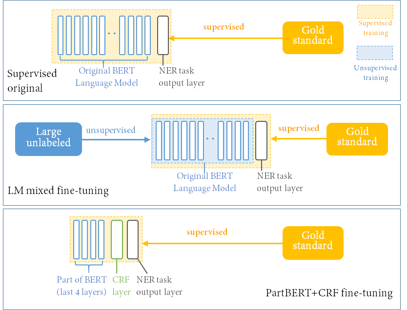

# Chinese Biomedical Patents NER

This repository includes the built datasets, source codes and trained models of our study **Named Entity Recognition for Chinese biomedical patents**. (Paper accepted by [COLING 2020](https://www.aclweb.org/anthology/2020.coling-main.54/))

## Abstract
There is a large body of work on Biomedical Entity Recognition (Bio-NER) for English. There have only been a few attempts addressing NER for Chinese biomedical texts. 

Because of the growing amount of Chinese biomedical discoveries being patented, and lack of NER models for patent data, we train and evaluate NER models for the analysis of Chinese biomedical patent data, based on BERT. 

By doing so, we show the value and potential of this domain-specific NER task. For the evaluation of our methods we built our own Chinese biomedical patents NER dataset, and our optimized model achieved an F1 score of 0.54±0.15. Further biomedical analysis indicates that our solution can help detecting meaningful biomedical entities and novel gene--gene interactions, with limited labeled data, training time and computing power.


## Configuration
Enviornment files in `/env`.  
Configure the python environment using:
```bash
#using pip
pip install --upgrade pip
pip install -r ./env/cbp.txt

#or using conda
conda env create -f ./env/cbp.yml
```

## Datasets
The `/data` contains all our built datasets.  
<details><summary>Detailed dataset information</summary>
<p>

#### Labeled dataset
The derictory `cbp_gold` contains our finally built gold standard dataset (humanly labeled), which are `cbp_gold_total.bio` (original version) and `no_long_cbp_gold_total.bio` (no-long-sentences version). This gold standard dataset contains 5,813 sentences and 2,267 unique named entities, built from 21 Chinese biomedical patents.
It was annotated with IOB format labels and we only annotated out gene/protein/disease entities. In the data document, each line only contains one character and its corresponding IOB tag.

Under the directory `cbp_gold`, there are also 5 sub-directories (from `0` to `4`), which contain the detailed evaluation sets we built from our original gold standard dataset and were finally applied in all our NER evaluation experiments. Under each sub-directory, the filename suffix indicates whether it is train, test or dev set, while the prefix indicates whether it contains long sentences. (file with prefix `no_long` does not contain sentences longer than 500 characters, exceeded length sentences will be split into sub-sentences.)

#### Unlabeled datasets
`BC` and `HG` are two unlabeled Chinese Biomedical Patents datasets, which were both retrieved from Google Patents Databases. `BC` contains patents matching the query "人类AND基因" ('human AND gene'), from 1st January 2009 to 1st January 2019 with patent code starting with 'CN'. `HG` contains patents matching the query  "乳腺癌AND生物标记物" ('breast cancer AND biomarker'), from 1st December 2012 to 1st January 2019 with patent code starting with 'CN' as well. After some filtering and cleaning steps (detailed steps see our paper), `BC` and `HG` datasets finally contain 2,659 and 53,007 patents, respectively.

The `part_BC` and `part_HG` were part of both datasets, which contain 100 and 10,000 patents randomly selected from `BC` and `HG` datasets, respectively. They were processed as the suggested format for the transformers frame we applied and were finally used in our Language Model fine-tuning experiments (Mixed_LM).

Here we would not upload these unlabeled datasets since they are all relatively large and are not necessary if you just want to reproduce our NER results or use our trained models. 

Further information, like statistics of and pre-processing steps we applied on all our built dataset, can be found in our paper. 

</p>
</details>

## Models
Here we release 3 models generated during our experiments which you can use to either reproduce our results or run your own customized experiments.

The `/partHG_1epoch` is the bert-base-chinese model been fine-tuned on our large unlabeled dataset `HG` for 1 epoch, while `/partBC_30epochs` on unlabeled dataset `BC` for 30 epochs. These 2 fine-tuned lanaguage model can be used to run your customized NER experiments or be loaded to continue fine-tuning on more data/epochs.

The `/final_trained` is the NER model trained on our whole labeled dataset `cbp_gold`, using the fine-tuned language model `/partHG_1epoch`. It is also our final selected model to generate predictions on unlabeled dataset for further analysis. This NER model is possible to be directly applied on new data to generate NER predictions.

<details><summary>Detailed model information</summary>
<p>

Our methods are based on pre-trained BERT models. We designed and implemented three different learning methods to train our NER models using our built datasets:
 - **Supervised original**: fine-tuning all weights (BERT model layers plus NER layer) using a relatively small learning rate 5*10^(-5), with our labeled dataset;
 - **LM mixed fine-tuning**: first tune the weights of the BERT language model layers with the unlabeled dataset; then repeat the supervised original learning step (Finally optimal one in our experiments, further predictions and released models are all based on this model); 
 - **PartBERT+CRF fine-tuning**: fine-tune the weights of part of the BERT model (last 4 layers) plus an added CRF layer, trained with our labeled dataset.




</p>
</details>

## Run experiments
The directories `/Supervised_Original`, `/BERT_LM_mixed` and `/partBERT_CRF` contain the source codes of corresponding training methods described in our paper.

To make sure your configurations are sufficient and ready, you can run a demo NER experiment for only 1 epoch by simply running `demo_run.sh` of each method.

**Reproduce our NER results**  
To reproduce our final evaluation experiments of `/Supervised_Original` and `/partBERT_CRF`, change the GPU resource related parameters of each `iter_exp.sh` file, like available GPU id and possible batch size, then simply run it. 


For `/BERT_LM_mixed` method, first you need to download the bin files of each model in correspoding directories.

* Download [partHG_1epoch_bin](https://ufile.io/4ub90d6l) under `./models/partHG_1epoch`
* Download [partBC_30epochs_bin](https://ufile.io/t7qqx58r) under `./models/partBC_30epochs`
* Download [final_trained_bin](https://ufile.io/wybcaiui) under `./models/final_trained` 


<details><summary>百度网盘下载地址</summary>
<p>

* Download [partHG_1epoch_bin](https://pan.baidu.com/s/1-ev7b3pDx_JnAU2pZ1V10w) under `./models/partHG_1epoch`
* Download [partBC_30epochs_bin](https://pan.baidu.com/s/1EQ61sQ-9VkX5PZ3VaPhi7g) under `./models/partBC_30epochs`
* Download [final_trained_bin](https://pan.baidu.com/s/1B9iZ7S2OjqiQ211qR_jQ4A) under `./models/final_trained` 
* 提取码均为：1137

</p>
</details>


Then rename all model bin files as `pytorch_model.bin`

There are 2 sub-directories under `/BERT_LM_mixed`.  
The `/lmft_example` contains codes to fine-tune the `bert-base-chinses`, while `/ner_example` contains codes to run NER experiments using fine-tuned language models.

To reproduce the evaluation results of this method, you can run the `/iter_exp_bc.sh` and `iter_exp_hg.sh`, which apply our 2 fine-tuned language models `/partBC_30epochs` and `/partHG_1epoch`, respectively. Also don't forget to customize the GPU resource related parameters in the scripts.

**Run the language model fine-tuning expriments**  
To fine-tune the original BERT language model with your own data, change the `data_dir` parameter of `run_lmft.sh` to your data directory, then directly run this script.  

To continue fine-tuning our tuned language model with more data or more epochs, change either the `data_dir` parameter to your data directory or the `num_train_epochs` parameter to your planned epochs of `run_lmft_load.sh`, then change the `model_name_or_path` parameter to the model directory you want to load from. 

Also don't forget to customize the GPU resource related parameters in the scripts.
  
